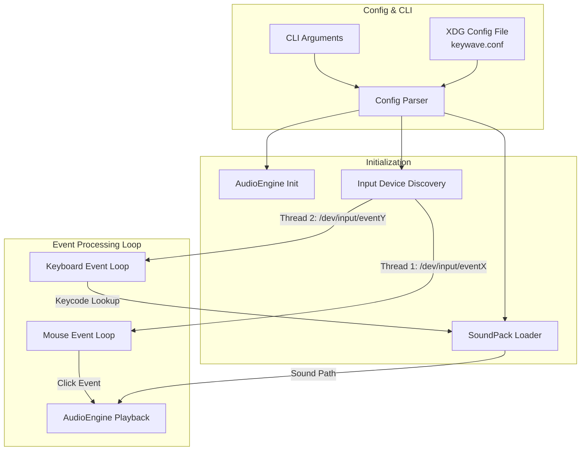

# Architecture & Design of Keywave

This document provides an in-depth technical overview of Keywave's architecture, subsystems, concurrency model, data flow, and design decisions.

---

## 1. Overview

Keywave is a lightweight, low-latency background daemon written in modern C++ (C++17) for Linux. It captures low-level keyboard and mouse events directly from the Linux `evdev` interface and plays synchronized mechanical switch / click audio feedback using an embedded audio engine.



---

## 2. Subsystems & Components

### 2.1 Configuration Subsystem (`include/keywave/config.h`, `src/config.cpp`)
The configuration system handles reading application parameters with a strict hierarchy of precedence:
1. **Command-line arguments** (highest precedence).
2. **Configuration file** (`$XDG_CONFIG_HOME/keywave/keywave.conf` or fallback `~/.config/keywave/keywave.conf`).
3. **Hardcoded defaults** (fallback when no config exists).

**Key Features:**
- **Zero-allocation / String Views**: String trimming and key/value extraction utilize `std::string_view` to avoid unnecessary heap allocations during parsing.
- **Tilde & Environment Expansion**: Paths starting with `~` are expanded to `$HOME`.
- **Validation**:
  - `volume`: Strictly validated as a non-negative `float` (e.g. `0.8`, `1.0`).
  - Section headers `[...]` and comments starting with `#` or `;` are cleanly ignored.

---

### 2.2 Device Discovery Subsystem (`include/keywave/device.h`, `src/device.cpp`)
Linux organizes physical and virtual input hardware under `/dev/input/event*`. Rather than relying on windowing systems (X11 or Wayland), Keywave operates directly at the kernel input subsystem layer.

**Mechanism:**
- **Capability Bitmasks**: Queries device event capabilities using `ioctl(fd, EVIOCGBIT(EV_KEY, ...), keybits)`.
  - Keyboard discovery checks for the presence of standard keys (e.g., `KEY_A`).
  - Mouse discovery checks for primary mouse buttons (`BTN_LEFT`).
- **RAII Resource Management**: File descriptors for probed devices are wrapped in a move-only `UniqueFd` RAII helper to prevent descriptor leaks during probing.

---

### 2.3 Soundpack Subsystem (`include/keywave/soundpack.h`, `src/soundpack.cpp`)
Keywave is fully compatible with standard Mechvibes / Wayvibes soundpack structures.

**Structure of a Soundpack:**
```
soundpack_directory/
├── config.json
├── 30.wav       # Key A (evdev 30)
├── 31.wav       # Key S (evdev 31)
└── ...
```

**Loading & Mapping:**
- Parses `config.json` containing the pack name and a `defines` dictionary mapping stringified Linux evdev keycodes (`"30"`) to audio filenames (`"30.wav"`).
- Maps keycodes into an `std::unordered_map<int, std::string>` for $O(1)$ lookup time during keystroke events.
- Intentionally skips composite soundtracks (e.g. `"sound.wav"`) to avoid playback overlap for unmapped keys.

---

### 2.4 Audio Engine Subsystem (`include/keywave/audio.h`, `src/audio.cpp`)
Audio mixing and low-latency playback are powered by **miniaudio**—a single-file, zero-dependency C audio library.

**Design Highlights:**
- **PIMPL Idiom**: The `AudioEngine` class wraps `miniaudio` engine handles via `std::unique_ptr<Impl>`. This prevents exposing internal miniaudio C headers to the rest of the project and reduces compile times.
- **Volume Normalization**: Direct hardware/software master volume scaling using `ma_engine_set_volume`.
- **Concurrent Fire-and-Forget Playback**: `playSound` invokes `ma_engine_play_sound`, which decodes and mixes audio asynchronously in a background audio thread without blocking the input event loops.

---

## 3. Concurrency & Threading Model

Keywave uses an asynchronous multi-threaded model:

```
Main Thread (Signal Handling & Lifecycle)
  ├── Thread 1 (Keyboard Listener) -> read(/dev/input/eventX) -> O(1) soundpack lookup -> AudioEngine
  └── Thread 2 (Mouse Listener)    -> read(/dev/input/eventY) -> AudioEngine
```

- **Non-blocking IO & Polling**: Input event descriptors are opened in `O_NONBLOCK` mode. If no event is available, threads sleep briefly (`usleep(1000)`) to yield CPU cycles without inducing noticeable latency.
- **Graceful Shutdown**: An `std::atomic<bool> g_running{true}` flag controls the lifecycle of worker threads. Signal handlers for `SIGINT` and `SIGTERM` set this flag to `false`, allowing worker threads to cleanly close file descriptors and join the main thread.

---

## 4. Error Handling Strategy

1. **Missing Devices / Permissions**: If `/dev/input` cannot be read or user lacks permissions (not in `input` group), Keywave prints a descriptive error and exits with code 1.
2. **Corrupted / Incomplete Soundpacks**: Soundpack parsing verifies schema existence (`defines`). If corrupted or invalid JSON is encountered, it logs the error without crashing.
3. **Invalid Config Options**: Config syntax errors, invalid volume values, or non-existent custom config paths immediately stop execution with an exit status of 1.
